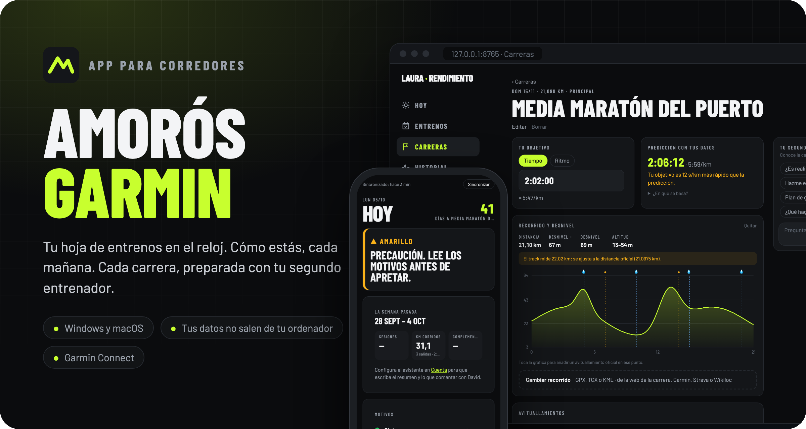
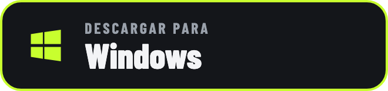
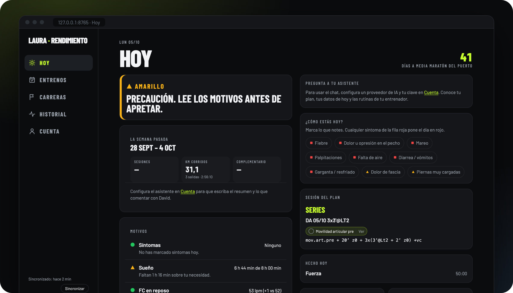
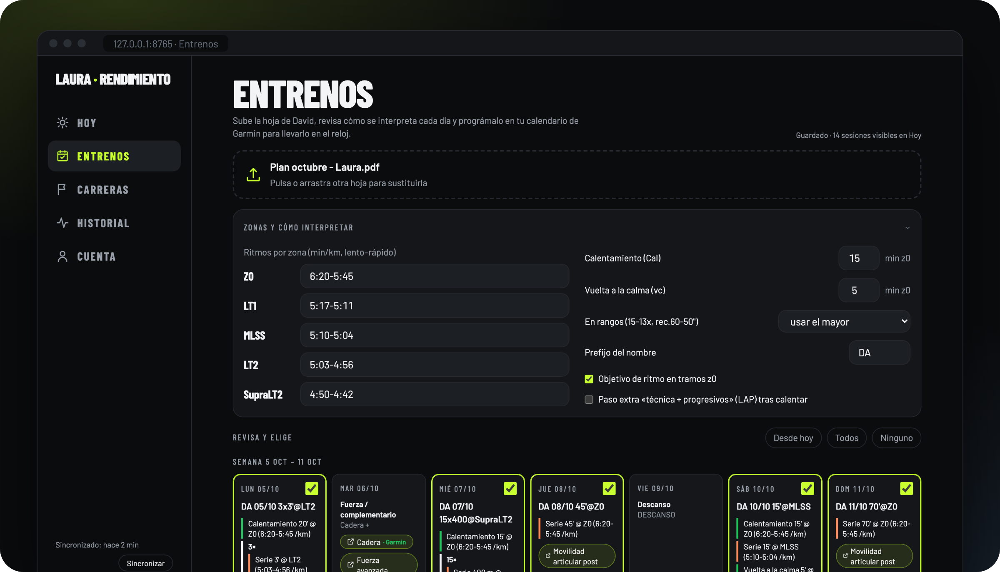
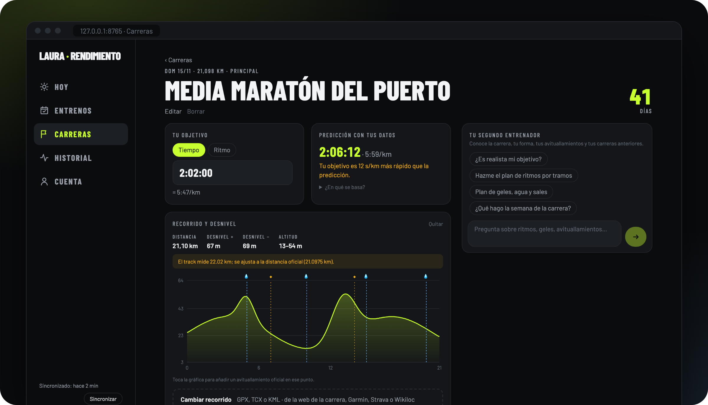
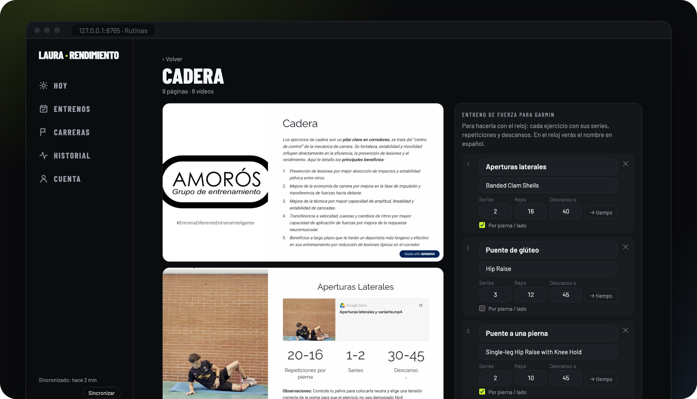
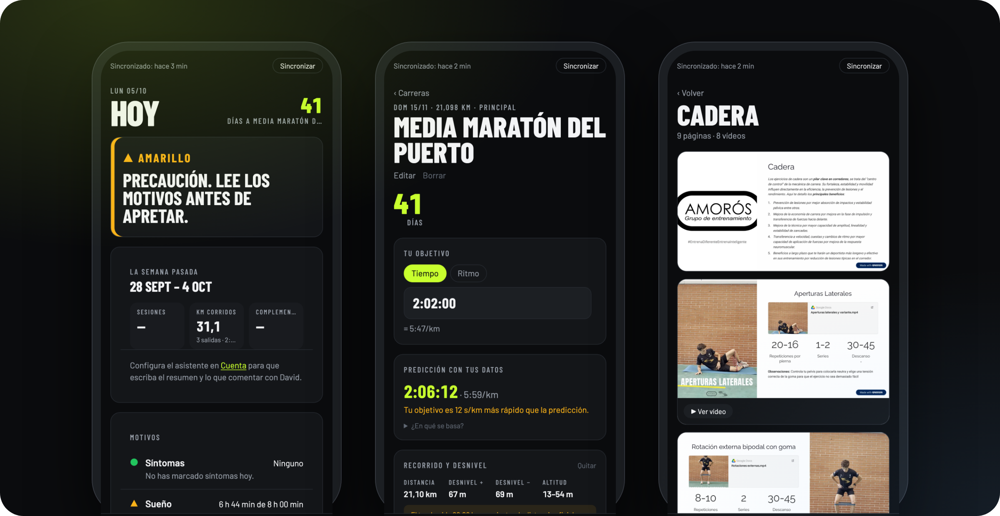

<p align="center">
  
</p>

<p align="center">
  <a href="https://github.com/juancholab/automatizar_entrenos_running/releases/latest/download/Instalar-Amoros-Garmin.bat"></a>
  &nbsp;&nbsp;
  <a href="https://github.com/juancholab/automatizar_entrenos_running/releases/latest/download/Instalar-macOS.zip"></a>
</p>

<p align="center">
  <a href="https://github.com/juancholab/automatizar_entrenos_running/releases/latest"></a>
  
  
</p>

---

**Amorós Garmin** es una app para corredores que entrenan con la hoja de David Amorós. Convierte la hoja en entrenos estructurados de **Garmin Connect** y los programa en tu reloj, te dice cada mañana cómo estás para entrenar y te ayuda a preparar cada carrera con un **segundo entrenador** que conoce tus datos.

Funciona en tu ordenador, se instala con un doble clic y tus datos no salen de él.

## Lo que hace

### Hoy: cómo estás para entrenar

Un semáforo con tus datos de Garmin (sueño, VFC, pulso en reposo, Body Battery, carga) y los síntomas que marques, la sesión del plan con sus rutinas complementarias y un asistente al que preguntarle lo que quieras sobre tu día. Domingo y lunes, el **resumen de la semana**: lo planificado frente a lo hecho y qué comentar con tu entrenador, listo para copiar.



### Entrenos: la hoja de tu entrenador, en el reloj

Sube la hoja (PDF o Word) y la app entiende la notación: `Cal + 15-13x (400@SupraLt2 rec.60-50") + vc`, zonas, rangos, continuos variables… Revisa cada día, corrígelo si hace falta y **envíalo a Garmin**: cada entreno queda programado en su fecha, con ritmos objetivo, y el complementario (fuerza, cadera, core…) también, como entreno de fuerza.

¿Cambiaste los días? **Arrastra cada sesión al día en que la haces** (o añade un pilates): el calendario de Garmin, el resumen semanal y la pestaña Hoy se ajustan solos, y te avisa si quedan dos días duros seguidos. Cuando tu entrenador te mande la hoja nueva, súbela: las semanas pasadas y tus cambios se conservan.



### Carreras: cada carrera, preparada en privado

Para cada carrera: tu **objetivo** (en tiempo o ritmo), la **predicción** que sale de tus entrenamientos, el **perfil de desnivel** (sube el GPX de la carrera), los **avituallamientos** oficiales y lo que llevas tú, y un **plan de ritmos por kilómetro** que reparte el esfuerzo según las cuestas. Al lado, tu **segundo entrenador**: pregúntale si tu objetivo es realista, cómo gestionar geles y agua o qué hacer la semana de la carrera. Después, vincula tu actividad de Garmin, cuenta cómo fue y **aprende para la siguiente**.



### Rutinas complementarias

Las rutinas de tu entrenador se ven dentro de la app, con sus vídeos, y se enlazan solas con los días del plan que las nombran. Márcalas como hechas y conviértelas en **entrenos de fuerza de Garmin** para hacerlas con el reloj: series, repeticiones y descansos, con el nombre del ejercicio en español.



### Pensada también para el móvil



<sub>El diseño ya está adaptado al móvil; el acceso desde el móvil llega en una próxima versión.</sub>

## Instalación

### Windows

1. [Descarga el instalador](https://github.com/juancholab/automatizar_entrenos_running/releases/latest/download/Instalar-Amoros-Garmin.bat) y haz **doble clic** en él.
2. Si aparece *«Windows protegió su PC»*: pulsa **Más información** → **Ejecutar de todas formas**.
3. Espera a que termine (la primera vez, unos minutos). Se abre la app en tu navegador y queda el icono **Amorós Garmin** en el Escritorio y en el menú Inicio.

### Mac

1. [Descarga el instalador](https://github.com/juancholab/automatizar_entrenos_running/releases/latest/download/Instalar-macOS.zip), ábrelo y haz **doble clic** en *Instalar Amorós Garmin*.
2. Si el Mac dice que no puede verificar el desarrollador: **Ajustes del Sistema** → **Privacidad y seguridad** → **Abrir igualmente**, y vuelve a hacer doble clic.
3. Espera a que termine. Se abre la app en tu navegador y queda **Amorós Garmin** en el Escritorio y en la carpeta Aplicaciones de tu usuario.

<details>
<summary>Instalar desde Terminal (Mac, sin avisos)</summary>

```bash
curl -fsSL https://github.com/juancholab/automatizar_entrenos_running/releases/latest/download/instalar-macos.sh | bash
```
</details>

El instalador **no pide contraseña de administrador** y lo deja todo en tu usuario. Si ya tienes Python 3.11 o superior lo usa; si no, instala uno solo para la app.

## Primeros pasos

1. **Cuenta → Conectar con Garmin**: tu email, contraseña y, si te lo pide, el código de verificación.
2. **Entrenos**: sube la hoja de tu entrenador y envía los entrenos al reloj.
3. **Carreras**: añade tus carreras y prepara cada una.
4. **Cuenta → Asistente** *(opcional)*: para el chat, el resumen semanal y el segundo entrenador. Puedes usar **tu suscripción a Claude con Claude Code** (sin pagar API), **modelos locales gratis con Ollama**, o una clave de API de Anthropic, OpenAI o Google.

## Privacidad

- La app funciona **en tu ordenador** y solo se abre desde él (`127.0.0.1`). No hay servidores de terceros ni cuentas nuevas.
- La **contraseña de Garmin no se guarda**: se usa una vez para obtener la sesión, que queda en tu usuario.
- Tus datos (actividades, sueño, plan, carreras, notas) se guardan en tu ordenador y **no se suben a ninguna parte**.
- Si activas el asistente, las preguntas que le hagas se envían, con el contexto necesario, al proveedor de IA que elijas (con Ollama no salen de tu ordenador).

## Preguntas frecuentes

<details>
<summary><b>¿Cuánto cuesta?</b></summary>

La app es gratuita. El asistente es opcional y tiene opciones sin coste extra: **Claude Code** usa tu suscripción a Claude y **Ollama** ejecuta modelos gratis en tu ordenador (los pequeños se equivocan más). Con una clave de API pagas a ese proveedor lo que consumas.
</details>

<details>
<summary><b>¿Funciona con mi reloj?</b></summary>

Con cualquier reloj Garmin que admita entrenos estructurados desde Garmin Connect (Forerunner, Fenix, Epix, Venu, Vivoactive…). Los datos de salud que veas dependen de lo que mida tu reloj: si no tiene VFC, por ejemplo, lo verás como «sin dato».
</details>

<details>
<summary><b>¿Necesito saber de informática o instalar Python?</b></summary>

No. El instalador se encarga de todo; si ya tienes Python 3.11 o superior, lo aprovecha.
</details>

<details>
<summary><b>¿Cómo actualizo?</b></summary>

En la app: **Cuenta → Buscar actualizaciones**. También puedes volver a ejecutar el instalador: actualiza sin tocar tus datos.
</details>

<details>
<summary><b>¿Cómo la desinstalo?</b></summary>

Windows: menú Inicio → **Desinstalar Amorós Garmin**. Mac: **Desinstalar Amorós Garmin** en la carpeta Aplicaciones de tu usuario. Te pregunta si quieres borrar también tus datos.
</details>

---

<sub>Proyecto independiente: no es una app oficial de Garmin. Garmin y Garmin Connect son marcas de Garmin Ltd. o sus filiales. Las rutinas complementarias son material del entrenador David Amorós.</sub>
